# TradingCommandCenter — Architecture Diagram

This diagram describes the solution as a .NET 10 modular monolith/host with reusable domain, application, capability, infrastructure, and UI projects. `Trading.Api` is the primary composition root and can run either as the web/API host or as a command-line workflow host.

```mermaid
flowchart TB
    %% Entry points and host
    subgraph Entry[Entry points]
        Browser[Operator browser]
        ApiHost[Trading.Api\n.NET 10 executable\nHTTP/API + CLI command host]
        Downloader[Trading.DataDownloader\nstandalone CLI]
    end

    subgraph Presentation[Presentation and composition]
        Web[Trading.Web\nBlazor/Razor components\nOverview, reports, candidates, certificates, analyses, feeds, paper, live]
        Commands[Trading.Api command handlers\nmarket data, research, backtest, risk, paper/live, qualification, reconciliation, automation]
    end

    subgraph Core[Core contracts and business model]
        Application[Trading.Application\nuse cases, ports, DTOs, codecs\nmarket data, research, execution, backtesting]
        Domain[Trading.Domain\nentities and value objects\ncandles, instruments, orders, trades, sessions]
    end

    subgraph Capabilities[Trading capabilities]
        MarketData[Trading.MarketData\nCSV/manifest import\nhistorical candle and option data]
        Strategies[Trading.Strategies\nstrategy catalog, contracts, certificates]
        Risk[Trading.Risk\ndeterministic risk policies\nposition sizing and validation]
        Backtesting[Trading.Backtesting\nnative deterministic simulator\ncost/slippage models]
        ExternalValidation[Trading.ExternalValidation\nLEAN adapter and process runner]
        Execution[Trading.Execution\npaper, live, Zerodha feed/client\ncontrolled automation]
        AI[Trading.AI\nAzure OpenAI backtest/research analysts]
    end

    subgraph Infrastructure[Infrastructure and state]
        Persistence[Trading.Infrastructure\nEF Core persistence adapters]
        Database[Trading SQL Server database<br/>market data, research runs, candidates,<br/>certificates, analyses, feed captures,<br/>paper/live ledger, reconciliation, automation state]
    end

    subgraph External[External systems and processes]
        Upstox[Upstox historical candle API]
        Zerodha[Zerodha APIs\nmarket feed, orders, reconciliation]
        AzureOpenAI[Azure OpenAI]
        Lean[QuantConnect LEAN\ncontainer/process validation engine]
        Vectorbt[Vectorbt research worker\nexternal research process]
    end

    subgraph Verification[Verification projects]
        UnitTests[Trading.UnitTests]
        IntegrationTests[Trading.IntegrationTests]
        BacktestTests[Trading.BacktestTests]
        StrategyTests[Trading.StrategyValidationTests]
    end

    Browser --> Web
    Web --> ApiHost
    ApiHost --> Commands
    ApiHost --> Web

    Downloader --> MarketData
    Downloader --> Upstox

    Commands --> Application
    Commands --> MarketData
    Commands --> Strategies
    Commands --> Risk
    Commands --> Backtesting
    Commands --> ExternalValidation
    Commands --> Execution
    Commands --> AI
    Commands --> Persistence

    Web -. hosted by .-> ApiHost
    MarketData --> Application
    Strategies --> Domain
    Risk --> Domain
    Backtesting --> Domain
    Backtesting --> Strategies
    Backtesting --> Risk
    ExternalValidation --> Application
    Execution --> Application
    AI --> Application
    Application --> Domain

    Persistence --> Application
    Persistence --> Database
    MarketData --> Persistence
    Execution --> Persistence
    AI --> AzureOpenAI
    ExternalValidation --> Lean
    Backtesting -. research worker integration .-> Vectorbt
    MarketData -. live/historical provider integration .-> Zerodha
    Execution --> Zerodha

    UnitTests --> Domain
    UnitTests --> Application
    UnitTests --> MarketData
    UnitTests --> AI
    IntegrationTests --> ApiHost
    IntegrationTests --> Downloader
    BacktestTests --> Backtesting
    BacktestTests --> ExternalValidation
    StrategyTests --> Strategies
    StrategyTests --> Risk

    classDef host fill:#0b5cab,color:#fff,stroke:#083b73
    classDef core fill:#e8f1ff,stroke:#3973ac
    classDef capability fill:#eaf7ea,stroke:#4b8f4b
    classDef infra fill:#fff2cc,stroke:#b28a00
    classDef external fill:#f6e6ff,stroke:#8b4bb3
    classDef test fill:#eeeeee,stroke:#777
    class ApiHost,Downloader host
    class Application,Domain core
    class MarketData,Strategies,Risk,Backtesting,ExternalValidation,Execution,AI capability
    class Persistence,Database infra
    class Upstox,Zerodha,AzureOpenAI,Lean,Vectorbt external
    class UnitTests,IntegrationTests,BacktestTests,StrategyTests test
```

## Project dependency summary

| Area | Projects | Responsibility |
|---|---|---|
| Host/UI | `Trading.Api`, `Trading.Web` | Composition root, HTTP/Razor host, CLI workflows, operator screens |
| Core | `Trading.Application`, `Trading.Domain` | Stable business contracts, ports, entities, value objects, use-case models |
| Capabilities | `Trading.MarketData`, `Trading.Strategies`, `Trading.Risk`, `Trading.Backtesting`, `Trading.ExternalValidation`, `Trading.Execution`, `Trading.AI` | Import, strategy evaluation, risk controls, native/independent validation, broker execution, AI analysis |
| Infrastructure | `Trading.Infrastructure` | EF Core SQL Server persistence and state stores |
| Tooling | `Trading.DataDownloader` | Upstox historical-data download/import support |
| Verification | `Trading.UnitTests`, `Trading.IntegrationTests`, `Trading.BacktestTests`, `Trading.StrategyValidationTests` | Unit, host/integration, backtest, strategy/risk validation |

## Important boundary

`Trading.Backtesting` is a deterministic simulator and does not place or route orders. Live broker interaction is isolated in `Trading.Execution`, while `Trading.ExternalValidation` provides an independent LEAN validation path. Controlled automation evaluates qualification, paper qualification, reconciliation, state freshness, limits, and operator approval before any live action can become eligible.
