# TradingCommandCenter — Data-Flow Diagram

The primary flow starts with market data, produces deterministic strategy evidence, and only then progresses through qualification and execution controls. Solid arrows represent data or commands; dashed arrows represent optional or independent validation paths.

```mermaid
flowchart LR
    Operator[Operator\nBrowser or CLI command]
    Config[Configuration\nappsettings + environment\nconnection strings and safety gates]

    subgraph Ingestion[1. Market-data ingestion]
        Upstox[Upstox historical candle API]
        Csv[CSV / manifest files]
        Downloader[Trading.DataDownloader]
        Importer[Trading.MarketData\nCandleCsvReader + manifest validation\nHistoricalCandleImporter]
        Feed[Trading.Execution.Zerodha\nZerodhaMarketFeed]
        Capture[Market-feed capture]
    end

    subgraph Store[Authoritative persisted state]
        DB[(Trading SQL Server / TradingDbContext)]
        CandleStore[Candles and instruments]
        OptionStore[Option chains / contracts]
        ResearchStore[Research runs, candidates, analyses]
        QualificationStore[Certificates and paper qualifications]
        ExecutionStore[Paper sessions, live orders, ledger, reconciliation, automation state]
        DB --- CandleStore
        DB --- OptionStore
        DB --- ResearchStore
        DB --- QualificationStore
        DB --- ExecutionStore
    end

    subgraph Research[2. Research and backtesting]
        ReadData[Application market-data ports]
        Strategy[Trading.Strategies\nstrategy catalog and evaluation]
        Risk[Trading.Risk\npolicy checks and position sizing]
        Native[Trading.Backtesting\ndeterministic native engine]
        NativeResult[Backtest result\ntrades, PnL, costs, ignored candidates]
        Vectorbt[Vectorbt research worker]
        Lean[Trading.ExternalValidation + LEAN\nindependent engine result]
        Compare[Cross-engine comparison\nand research integrity checks]
    end

    subgraph Evidence[3. Qualification and analysis]
        Candidate[Backtest candidate / strategy certificate]
        Paper[PaperTradingEngine\npaper session and qualification]
        Analyst[Trading.AI\nAzure OpenAI analyst]
        Analysis[Backtest/research analysis]
        Robustness[OOS, walk-forward, robustness\nand strategy validation workflows]
    end

    subgraph Execution[4. Execution and reconciliation]
        Intent[Trading intent\nobserve / semi-live / direct-live]
        Control[ControlledAutomationEngine\npolicy, freshness, loss/action limits,\nkill switch, operator approval]
        Proposal[Automation artifact / authorization\nshort-lived and hashed evidence]
        PaperExec[Paper trading execution]
        LiveEngine[LiveTradingEngine]
        Broker[Zerodha trading API]
        Reconcile[Live reconciliation\norders, fills, positions, PnL]
        State[Execution state snapshot\nopen positions, unresolved submissions, daily limits]
    end

    Operator --> Config
    Operator --> Downloader
    Operator --> Importer
    Operator --> Feed
    Operator --> Native
    Operator --> Paper
    Operator --> Intent

    Upstox --> Downloader
    Downloader --> Csv
    Csv --> Importer
    Importer -->|validate schema, instrument, tick size, duplicates| CandleStore
    Feed -->|ticks / candles| Capture
    Capture --> ExecutionStore
    Feed -. optional live feed source .-> ReadData

    CandleStore --> ReadData
    OptionStore --> ReadData
    ReadData --> Strategy
    Strategy -->|signals| Native
    Risk --> Native
    Native --> NativeResult
    NativeResult --> ResearchStore
    ReadData -. research dataset .-> Vectorbt
    Vectorbt -. independent research result .-> ResearchStore
    ReadData --> Lean
    Lean -. independent validation trades/results .-> ResearchStore
    NativeResult --> Compare
    Lean -. compare against native .-> Compare
    Compare --> ResearchStore

    ResearchStore --> Candidate
    NativeResult --> Robustness
    Compare --> Robustness
    Robustness --> QualificationStore
    Candidate --> Paper
    Paper -->|orders, fills, PnL, qualification evidence| QualificationStore
    Candidate --> Analyst
    ResearchStore --> Analyst
    Analyst --> Azure[Azure OpenAI]
    Azure --> Analyst
    Analyst --> Analysis
    Analysis --> ResearchStore

    QualificationStore --> Control
    ExecutionStore --> State
    State --> Control
    Intent --> Control
    Config --> Control
    Control -->|blocked| Blocked[Blocked decision\nrecorded with block codes]
    Control -->|observe only| Observe[Observe-only artifact]
    Control -->|proposal eligible| Proposal
    Control -->|direct submission eligible| Proposal
    Proposal --> PaperExec
    Proposal --> LiveEngine
    PaperExec --> ExecutionStore
    LiveEngine -->|submit, query, reconcile| Broker
    Broker -->|orders, fills, positions| Reconcile
    Reconcile --> ExecutionStore
    Reconcile --> State
    State --> ExecutionStore
    ExecutionStore -->|audit and status| Operator

    classDef source fill:#f6e6ff,stroke:#8b4bb3
    classDef store fill:#fff2cc,stroke:#b28a00
    classDef process fill:#eaf7ea,stroke:#4b8f4b
    classDef control fill:#ffe0e0,stroke:#b33a3a
    classDef output fill:#e8f1ff,stroke:#3973ac
    class Upstox,Csv,Operator,Config,Broker,Azure source
    class DB,CandleStore,OptionStore,ResearchStore,QualificationStore,ExecutionStore store
    class Downloader,Importer,Feed,Capture,ReadData,Strategy,Risk,Native,Vectorbt,Lean,Compare,Paper,Analyst,Robustness,PaperExec,LiveEngine,Reconcile,State process
    class Intent,Control,Proposal,Blocked,Observe control
    class NativeResult,Candidate,Analysis,Blocked,Observe output
```

## Flow stages

1. **Ingestion** — historical data comes from Upstox through the downloader or from validated CSV/manifest input. The market-data importer checks instruments, tick sizes, ranges, schema, and duplicate candles before writing to the database. Zerodha can provide a live feed whose captures are also persisted.
2. **Research and validation** — application ports read candles/options; strategies emit signals; risk policies and the deterministic native engine produce trades, costs, PnL, and ignored candidates. Vectorbt and LEAN are independent research/validation paths, and comparison/integrity workflows persist their evidence.
3. **Qualification and analysis** — research results become candidates/certificates, are tested with paper trading and robustness/OOS workflows, and can be analyzed by the Azure OpenAI-backed analysts. Qualification artifacts are persisted and become inputs to later automation checks.
4. **Execution and reconciliation** — controlled automation consumes strategy qualification, paper qualification, reconciliation hashes, configuration, and current execution state. It can block, observe, authorize a proposal, or authorize direct submission. Paper execution stays internal; live execution submits through Zerodha and feeds broker results back through reconciliation and the internal ledger.

## Safety boundary

A live action is not derived directly from a backtest signal. It must pass the controlled automation checks, including enabled mode, kill switch, evidence hashes, reconciliation/state freshness, daily action and loss limits, unresolved-submission/open-position checks, and (for direct live mode) operator approval and confirmation.
